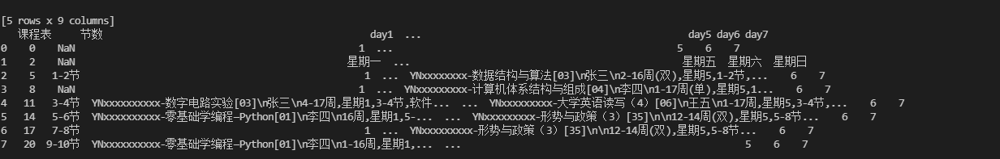
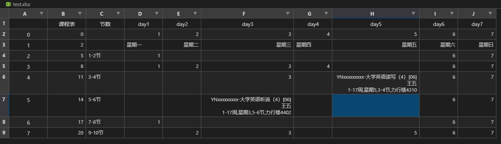
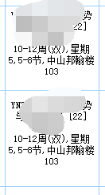
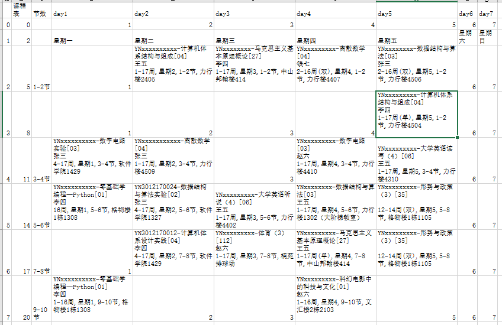

# ASSOY--云大学生自动排班（网页）

## 使用说明

将所有要统计的课表放入input文件夹， 然后运行main.py文件就能在numTable和freeTable中产生输出，freeTable文件夹中得到的就是空闲表

生成freeTable后可能存在表格显示效果不佳的问题，可以通过开启excel表格的自动换行获得良好的显示效果

## 技术选型

- 网站框架
  - flask编程框架

- 查找python处理excel表格文件的方法

  - pandas(读取写入慢，功能强，即可处理xls文件、也可处理xlsx文件，体积大)

  - xlrd & xlwt & xlutils（xlrd模块既可读取xls文件也可读取xlsx文件，xlwt模块只能写xls文件，不能写xlsx文件(写xlsx程序不会报错，但最后文件无法直接打开，会报错，速度最快，轻量）

  - OpenPyXL（可实现对excel文件的读、写和修改，只能处理xlsx文件，不能处理xls文件，速度和方案二接近，轻量）

  为了vscode的表格预览功能能够正常显示文件内容（excel viewer插件不能预览xlsx）以及出于兼容性的考虑，这里默认选用方案一（pandas也需要方案二和方案三中的库做支持才能完成对xlsx和xls的操作，相当于封装了方案二和三的库，用统一的方法进行表处理），如果需要考虑速度和表格规模，可以更换为其他方案

## 出现问题

1. pandas使用

   - 问题描述

     print有内容，但是使用to_excel方法时丢失了内容

   

   

   - 原因：单元格内部字符串过长导致vscode上的excel previewer插件显示不正常
   - 问题解决：插件问题，暂未解决，使用excel打开就行

2. excel中含有图片导致警告

   - 问题描述：

     因为excel中含有了图片，所以导致了以下警告，但是不影响运行
     `UserWarning: Workbook contains no default style, apply openpyxl's defaultwarn("Workbook contains no default style, apply openpyxl's default")`
     
   - 问题解决：不解决，不影响程序运行

3. 意外输入导致重复的index行名

   - 问题描述：

     这位辅修的卷王同学的课表上有一个时间段居然有三个课程（而且还冲突！！！），导致index中出现了多个Nan行名，会导致一个行名映射出多行，在合并这几行时会导致错误

   

   - 问题解决：

     修改合并行的逻辑，并且规定数值相加时超过3的取3

   - 问题联想：

     如果输入的课表是ACCA同学的，出现了一节课横跨三个时段（他们有课要连上三节）呢？

     这个问题我现在还找不到好的解法，

     <!--待改进，课程跨过了多个时间段-->

     

     后面发现，这可能也不是个问题，上图这两个是同一门课程，只不过跨了两个时间，在云大官网输出的课表上是分为两块的。

4. 算法问题

   - 问题描述：

     （算法题）有一个空闲表，表中一人最多只能出现两次，怎么安排能保证最大覆盖率？

     

     非最优解：从直观感觉来说，当然应该先确定选择最少的单元格

     方向：

     - 穷举剪枝法，最可能找到最优解，但是复杂度比较高，此处穷举有20^(5\*7)种可能，表格5\*7，人数20左右，用剪枝法去除不符合最高出现次数的情况

     - ？是否能用图的算法解决？
     - ？背包DP？
     - 先看选择最少的格子，对于只有一个人的cell，只能放此人

## 基本说明

1. 先使用pandas对表格内容进行精简，可以得到如下内容

   > 
   >
   > 根据内容再次简化为**课程01表**：5* 7的二维矩阵，以节数为行索引，星期数为列索引（索引不存在矩阵内），单周有课处填1，双周有课填2，无课处填0。
   >
   > 设计理由：由于有时两种课在不同周同一时间段，导致课表出现一节课有多行的情况，单双周的课相加刚好为3，而没课的0加上也不影响，可以直接多行对应位置相加。
   >
   > <!--待改进,上课周数的区别没有考虑，有精度丢失-->
   >
   > 用pandas.read_excel()，以星期为columns，以节数为index，但是出现了
   
2. 类

   >类名：人
   >
   >属性：姓名，课程表（numtable形式），值班时间用二元组表示`[星期一，1-2节]`，星期在前，节数在后
   >
   >

## 文件说明

- python虚拟环境
  
  - Lib
  
  - Scripts

  - pyvenv.cfg

  - Include

  - requirements.txt(打包环境需要的依赖)

### 0.0.1版（基本功能）

输入：n个云南大学学生课表

输出：m种空闲时间值班表，表示m种值班方案

其他：

1.输入能够存储在文件中，下次打开时不用再输入课表

2.能将m种值班方案输出为m个表格文件

3.当值班人员变化时能清空程序文件中现存的课表，以便输入新的课表

4.保证每人值班次数差不多

### 0.0.2版

添加功能：（实现以课表为单位的增删查）

1.能展示已经存入的所有课表

2.能增删已经存入的课表

3.能查找并展示某人的课表

### 0.0.3版

添加功能：

1.用户运行程序后选择值班地点，根据值班人的上课位置，根据上课位置到值班位置的距离选出较好的方案（比如值班位置定为力行楼，那么3-4节值班的同学最好是1-2节没课或在力行楼附近的位置上课）

2.如果有人在某值班时间段临时有事，能够给出所有可能的换班人选

