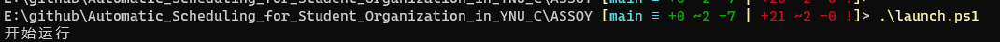
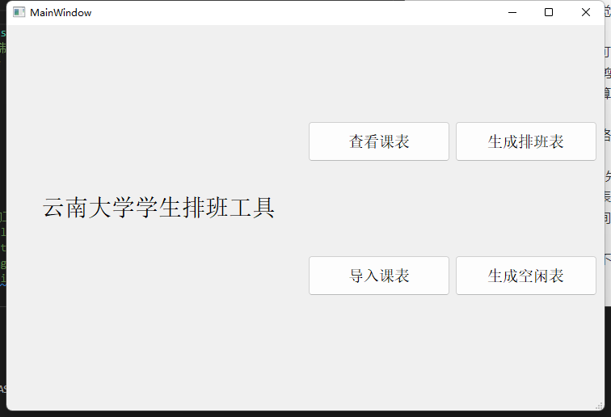
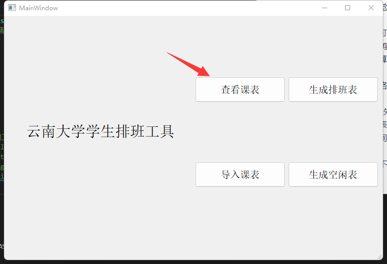
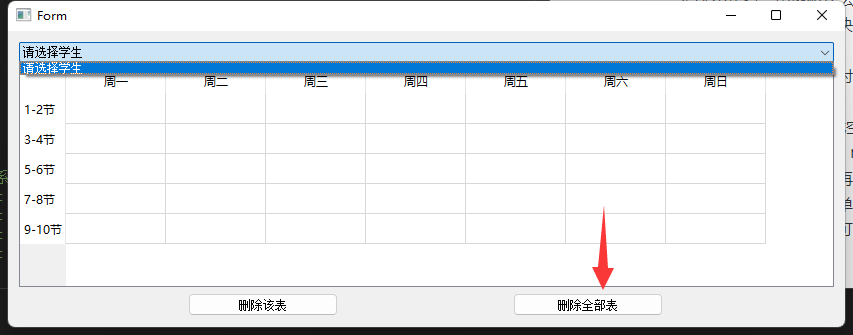
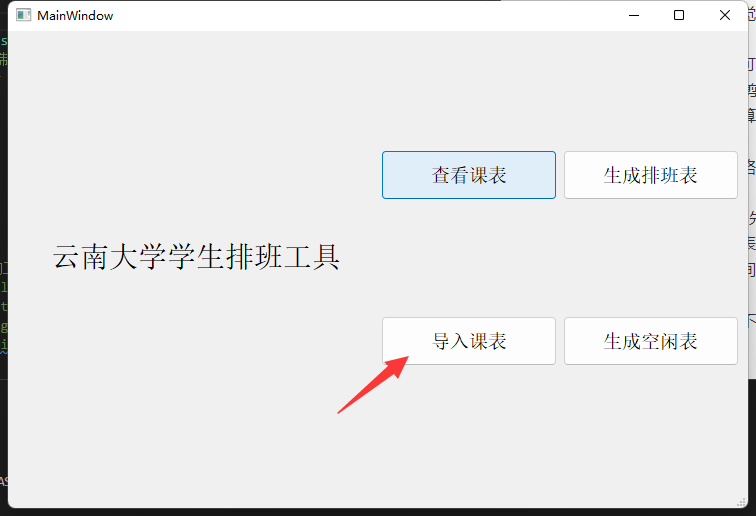
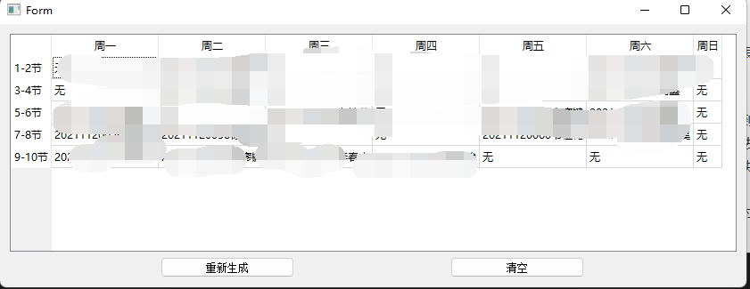

# ASSOY--云大学生自动排班（网页）

## 安装说明

| 环境说明         |                                             |
| ---------------- | ------------------------------------------- |
| 操作系统         | windows10以上                               |
| 语言环境         | python3.4以上                               |
| powershell命令行 | windows10以上自带，但是需要开启脚本运行权限 |

> 开启脚本运行权限
>
> 
>
> 在设置中搜索开发者，开启该选项
>
> 

1. 下载该源码包

2. 命令行进入源码包文件ASSOY，执行updateVenv.ps1脚本

   

3. 等待运行完成后，环境就配置完成了

## 使用说明

先命令行进入ASSOY目录（见“安装说明”）

在ASSOY目录下运行脚本launch.ps1,等待GUI界面出现





先清除现有课表






导入需要排班的同学的课表（课表名以学生名字命名，如有同名，建议加学号区分），可以多选excel文件



然后生成空闲表，生成值班表即可



## 技术选型

- GUI框架
  
  - pyQT5
  
- 查找python处理excel表格文件的方法

  - pandas(读取写入慢，功能强，即可处理xls文件、也可处理xlsx文件，体积大)

  - xlrd & xlwt & xlutils（xlrd模块既可读取xls文件也可读取xlsx文件，xlwt模块只能写xls文件，不能写xlsx文件(写xlsx程序不会报错，但最后文件无法直接打开，会报错，速度最快，轻量）

  - OpenPyXL（可实现对excel文件的读、写和修改，只能处理xlsx文件，不能处理xls文件，速度和方案二接近，轻量）

  为了vscode的表格预览功能能够正常显示文件内容（excel viewer插件不能预览xlsx）以及出于兼容性的考虑，这里默认选用方案一（pandas也需要方案二和方案三中的库做支持才能完成对xlsx和xls的操作，相当于封装了方案二和三的库，用统一的方法进行表处理），如果需要考虑速度和表格规模，可以更换为其他方案

## 出现问题及解决（具体代码见“实现方案说明”）

1. pandas使用

   - 问题描述

     print有内容，但是使用to_excel方法时丢失了内容

   

   

   - 原因：单元格内部字符串过长导致vscode上的excel previewer插件显示不正常
   - 问题解决：插件问题，暂未解决，使用excel打开就行

2. excel中含有图片导致警告

   - 问题描述：

     因为excel中含有了图片，所以导致了以下警告，但是不影响运行
     `UserWarning: Workbook contains no default style, apply openpyxl's defaultwarn("Workbook contains no default style, apply openpyxl's default")`
     
   - 问题解决：不解决，不影响程序运行

3. 不规整表格的意外输入导致重复的index行名

   - 问题描述：

     这位辅修的卷王同学的课表上有一个时间段居然有三个课程（而且还冲突！！！），导致index中出现了多个Nan行名，会导致一个行名映射出多行，在合并这几行时会导致错误

   

   - 问题解决：

     修改合并行的逻辑，并且规定数值相加时超过3的取3

   - 问题联想：

     如果输入的课表是ACCA同学的，出现了一节课横跨三个时段（他们有课要连上三节）呢？

     这个问题我现在还找不到好的解法，

     <!--待改进，课程跨过了多个时间段-->

     

     后面发现，这可能也不是个问题，上图这两个是同一门课程，只不过跨了两个时间，在云大官网输出的课表上是分为两块的，按照旧有的表处理方式就可以完成。

4. 值班表生成的算法问题

   - 问题描述：

     （算法题）有一个空闲表，表中一人最多只能出现两次，怎么安排能保证最大覆盖率？

     非最优解：从直观感觉来说，当然应该先确定选择最少的单元格

     方向：

     - 穷举剪枝法，最可能找到最优解，但是复杂度比较高，此处穷举有20^(5\*7)种可能，表格5\*7，人数20左右，用剪枝法去除不符合最高出现次数的情况

     - ？是否能用图的算法解决？
     - ？背包DP？
     - 先看选择最少的格子，对于只有一个人的cell，只能放此人
   - 解决方式：
     暂时使用的是方向4，先生成空闲表，再用sort_list列表记录每个单元格的空闲人数，sort_list中每个单元的元素为三元列表，[i, j, num]，i, j用来定位该时间快在表中的行列数，num为空闲人数，先安排空闲人数最少的时间段，再来处理空闲人数较多的时间段，能提高整个值班表的覆盖率但是无法保证达到最大覆盖率，每个单元格安排值班者时采用随机数从可选列表中选择一人，因此最终的值班表每次生成时可能不同，可以多生成几次。


## 实现方案说明

1. 输入表格的数据清洗：先使用pandas对表格内容进行精简，可以得到如下内容

   > 
   >
   > 根据内容再次简化为**课程01表**：5* 7的二维矩阵，以节数为行索引，星期数为列索引（索引不存在矩阵内），单周有课处填1，双周有课填2，无课处填0。
   >
   > 设计理由：由于有时两种课在不同周同一时间段，导致课表出现一节课有多行的情况，单双周的课相加刚好为3，而没课的0加上也不影响，可以直接多行对应位置相加。
   >
   > <!--待改进,上课周数的区别没有考虑，有精度丢失-->
   >
   > ```python
   > 	sheet = pd.read_excel(inputSheet, index_col=None,
   >                           header=3)  # 读取数据,不使用原表中的数据为表头,不使用原数据作为index
   >     sheet.dropna(axis=0, how='all', inplace=True)  # 删除全空的行
   >     # 重新索引,并且删除旧的index，不然会把旧的index加入数据中
   >     sheet.reset_index(drop=True, inplace=True)
   >     # 截去多余行
   >     key = 0
   >     end = 0
   >     for i in range(sheet.shape[0]):
   >         period = sheet.iloc[i, 0]
   >         if(period == '9-10节'):
   >             key = 1  # 开始判断是否到达课表结束行
   >         else:
   >             continue  # 如果没有到达课表结束行，则继续循环,不会进入条件语句，能减少复杂度
   >         #  开始判断，既不是9-10节，也不是空，那么一定是课表最后一行的后一行
   >         if(key == 1 and isinstance(period, str) and period != '9-10节'):
   >             end = i - 1  # 课表结束行
   >             break
   >         else:
   >             end = i
   >     sheet.drop(range(end + 1, sheet.shape[0]), inplace=True)  # 删除多余行(结束行之后的行)
   > ```
   >
   > 
   
2. 学生类的实现

   >类名：人
   >
   >属性：姓名，课程表（numtable形式和strTable形式），值班时间用二元组表示如用[0,4]表示['周一', '9-10节']，星期在前，节数在后
   >
   >```python
   >
   >class Student(object):
   >    """学生类, 存储名字、值班时间、数值化的课表、原始字符课表
   >    """
   >    name = str
   >    dutyTime = list
   >    numTable = pd.DataFrame
   >    strTable = pd.DataFrame
   >    tableRow = 0
   >    tableColumn = 0
   >
   >    def __init__(self, name=None, numTable=None, strTable=None):
   >        self.name = name
   >        self.dutyTime = []  # 存放学生的值班时间，每个元素为一个二元列表例如用[0,4]表示['周一', '9-10节']，用append()方法添加,用len()方法获取长度
   >        self.numTable = numTable
   >        self.strTable = strTable
   >        # self.tableRow, self.tableColumn = self.numTable.shape
   >
   >    def getName(self):
   >        return self.name
   >
   >    def getDutyTime(self):
   >        return self.dutyTime
   >
   >    def getNumTable(self):
   >        return self.numTable
   >
   >    def getStrTable(self):
   >        return self.strTable
   >
   >    def setDutyTime(self, row_num, column_num):
   >        """设置值班时间
   >
   >        Args:
   >            row_tag (str): 行标签
   >            column_tag (str): 列标签
   >        """
   >        self.dutyTime.append([row_num, column_num])
   >```
   >
   >3.值班表生成的算法问题(算法方案4)
   >
   >```python
   >def to_dutyTable(students):
   >    import random as rd
   >    # 获得一个freeTable（DataFrame类型，表中元素为student列表类型）的对象
   >    freeTable_str, freeTable_obj = to_freeTable(students)
   >    # 用来记录每个单元格的空闲人数，sort_list中每个单元的元素为三元列表，[i, j, num]，i, j用来定位该时间快在表中的行列数，num为空闲人数
   >    sort_list = []
   >    for i in range(5):
   >        for j in range(7):
   >            # 存入三元列表
   >            sort_list.append([i, j, len(freeTable_obj.iloc[i, j])])
   >    # 按照空闲人数排序，从小到大，以便后面先安排空闲人数最少的时间块
   >    sort_list.sort(key=lambda x: x[2])
   >    # 空闲人数为0的时间块无法排班，直接栈出
   >    while sort_list[0][2] == 0:
   >        sort_list.pop(0)
   >    print(sort_list)
   >
   >    res = []
   >    # 从sort_list中顺次pop出来进行处理，保证先安排空闲人数少的时间块，在安排空闲人数多的时间块
   >    while len(sort_list) > 0:
   >        # 如果num为0就pop出来，也是该循环的退出条件，保证不会死循环
   >        if sort_list[0][2] == 0:
   >            sort_list.pop(0)
   >            continue
   >        # 在i, j位置随机选择一个同学值班
   >        i, j, num = sort_list[0]
   >        # 随机选择一个同学放在该位置值班
   >        selected_student = Student()
   >        selected_student = freeTable_obj.iloc[i, j][rd.choice(range(num))]
   >
   >        # 一个同学不能一天值班多次，一周最多值班2次
   >        if len(selected_student.getDutyTime()) < 2:
   >            if len(selected_student.getDutyTime()) == 0:
   >                selected_student.setDutyTime(i, j)
   >                print(selected_student.getName())
   >                print(selected_student.getDutyTime())
   >                res.append([i, j, selected_student])
   >                
   >                # 从freeTable中删除该同学
   >                freeTable_obj.iloc[i, j].remove(selected_student)
   >                freeTable_obj
   >                sort_list.pop(0)
   >                continue
   >            if abs(selected_student.getDutyTime()[0][1] - j) > 1:
   >                # 如果同学上一次值班不是在同一天，则可以值班
   >                selected_student.setDutyTime(i, j)
   >                print(selected_student.getName())
   >                print(selected_student.getDutyTime())
   >                res.append([i, j, selected_student])
   >
   >                # 从freeTable中删除该同学
   >                freeTable_obj.iloc[i, j].remove(selected_student)
   >                sort_list.pop(0)
   >            else:
   >                # 从对象表中移除该同学
   >                freeTable_obj.iloc[i, j].remove(selected_student)
   >                # 更新该区可选人数
   >                sort_list[0][2] = len(freeTable_obj.iloc[i, j])
   >                continue
   >        else:
   >            # 从对象表中移除该同学
   >            freeTable_obj.iloc[i, j].remove(selected_student)
   >            # 更新该区可选人数
   >            sort_list[0][2] = len(freeTable_obj.iloc[i, j])
   >            continue
   >    return res, students
   >
   >```
   >
   >

## 文件说明

- python虚拟环境
  
  - Lib
  
  - Scripts

  - pyvenv.cfg

  - Include

  - requirements.txt(打包环境需要的依赖)
- 存储表格的文件
  - input 存储输入的表格，导入的表格会复制到该位置
  - numTable 存储数据清洗处理后的numTable数字表格，用来辅助其他功能的实现
  - strTable 存储数据清洗处理后的strTable字符串表格，用来向用户展示
  - freeTable 存储生成的空闲时间表


## 开发规划

- [x] 0.0.1版
- [x] 0.0.2版（查找功能还没有做搜索框）
- [ ] 0.0.3版

### 0.0.1版（基本功能）

输入：n个云南大学学生课表

输出：m种空闲时间值班表，表示m种值班方案

其他：

1.输入能够存储在文件中，下次打开时不用再输入课表

2.能生成多种符合要求的值班方案

3.当值班人员变化时能清空程序文件中现存的课表，以便输入新的课表

4.保证每人值班次数差不多

### 0.0.2版

添加功能：（实现以课表为单位的增删查）

1.能展示已经存入的所有课表

2.能增删已经存入的课表

3.能查找并展示某人的课表

### 0.0.3版

添加功能：

1.用户运行程序后选择值班地点，根据值班人的上课位置，根据上课位置到值班位置的距离选出较好的方案（比如值班位置定为力行楼，那么3-4节值班的同学最好是1-2节没课或在力行楼附近的位置上课）

2.如果有人在某值班时间段临时有事，能够给出所有可能的换班人选